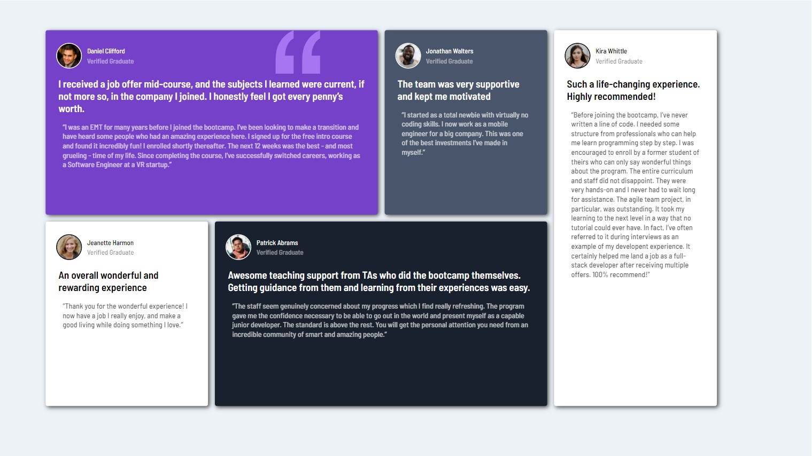

# Frontend Mentor - Testimonials grid section solution

This is a solution to the [Testimonials grid section challenge on Frontend Mentor](https://www.frontendmentor.io/challenges/testimonials-grid-section-Nnw6J7Un7). Frontend Mentor challenges help you improve your coding skills by building realistic projects. 

## Table of contents

- [Overview](#overview)
  - [The challenge](#the-challenge)
  - [Screenshot](#screenshot)
  - [Links](#links)
- [My process](#my-process)
  - [Built with](#built-with)
  - [What I learned](#what-i-learned)
  - [Useful resources](#useful-resources)
- [Author](#author)

**Note: Delete this note and update the table of contents based on what sections you keep.**

## Overview

### The challenge

Users should be able to:

- View the optimal layout for the site depending on their device's screen size

### Screenshot



### Links

- Solution URL: [Add solution URL here](https://github.com/disensee/grid-testimonials)
- Live Site URL: [Add live site URL here](https://dylanisensee.com/fementor/testimonials-grid-section/)

## My process

### Built with

- Semantic HTML5 markup
- CSS custom properties
- Flexbox
- CSS Grid


### What I learned

I had only used CSS grid once before in the past, so I started this project to get more familiar with how grids in CSS work. This is my first Front End Mentor, and I had a lot of fun with it. I am looking forward to moving on to more challenging projects. 
To see how you can add code snippets, see below:

I manually placed each card within in the grid. I'm not sure if this is a good way to go about grid positioning, but it gave me the opportunity to tinker with CSS grid items and worked just fine for the scope of this project. 

```css
.grid-container{
    background-color: hsl(210, 46%, 95%);
    height: fit-content;
    display: grid;
    grid-column-gap: 1em;
    grid-row-gap: 1em;
    grid-template-columns: 5% 20% 20% 20% 20% 5%;
    grid-template-rows: 5% 40% 40% 5%;
    height: 100vh;
    width: 100%;
}

.daniel {
    grid-column-start: 2;
    grid-column-end: 4;
    grid-row-start: 2;
    grid-row-end: 2;
}

.jonathan {
    grid-column-start: 4;
    grid-column-end: 4;
    grid-row-start: 2;
    grid-row-end: 2;
}

.jeanette {
    grid-column-start: 2;
    grid-column-end: 2;
    grid-row-start: 3;
    grid-row-end: 3;
}

.patrick {
    grid-column-start: 3;
    grid-column-end: 5;
    grid-row-start: 3;
    grid-row-end: 3;
}

.kira {
    grid-column-start: 5;
    grid-column-end: 5;
    grid-row-start: 2;
    grid-row-end: 4;
}
```

### Useful resources

- [Example resource 1](https://css-tricks.com/snippets/css/complete-guide-grid/) - This is the only resource I needed to learn more about Grid in CSS. I've used CSS Tricks in the past while learning about Flexbox, and it is a great resource when it comes to learning more about CSS. 


## Author

- Website - [Dylan Isensee](https://www.dylanisensee.com)
- Frontend Mentor - [@disensee](https://www.frontendmentor.io/profile/disensee)
- Twitter - [@dylanisensee](https://twitter.com/dylanisensee)
